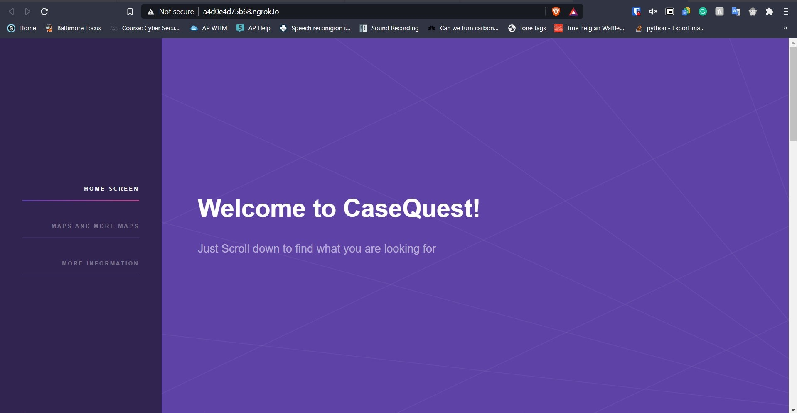

# COVID-19-Web-App
# Wolverine Hack Club
___

A COVID-19 Tracking Website built by students at Western Tech HS in MD.

___

## Building The Project in A Local Environment

We recomend building a Python 3.7+ environment, but we are pretty confident it could work in most Python 3 environments.

We also recomend running this in a virtual environment during development which can be done a variety of ways:

#### Creating a venv:

Navigate to the folder of the repository using 

-       $ cd path/to/repo

Then use command:

-       $ python3 -m venv venv

#### Activating the venv:

-   Linux
    -       $ . venv/bin/activate

- Windows
    -       $ ./venv/scripts/activate

#### Installing Necessary Modules:

To install the various modules needed for the program you can run the `setup.py` program from the shell.

-       $ python3 setup.py

This will install needed modules for the projsect to run.

#### Running the Project:

To run the project run the following commands based on OS and terminal:

- Linux

    -       $ export FLASK_APP=hello.py 
    -       $ flask run  

- Windows
    
    - Command Prompt:
        
        -       set FLASK_APP=main.py
        
        -       flask run
    
    - Powershell:
        
        -       $env:FLASK_APP="main.py" 
        -       flask run

This will run a basic webserver and the rest of the web-scraping and data-analysis code.

Click the NGROK link or run in localhost, you should see something like this:

---

## Contributing to the Project

If you would like to contribute, we appologize for the poorly written code without documentation, but even after that if you would like to contribute here is how:

If you have a bug report, idea, or suggestion, make a post under the issues tab where we can add it to the milestones list and add it to the program.

If you have a change you would like to make, please make a post to the issues tab, and fork the repository, then once your done make a pull request to development, if you add any new modules, we kindly ask you add the name of the module to the 2nd list of modules in the `setup.py` file.
